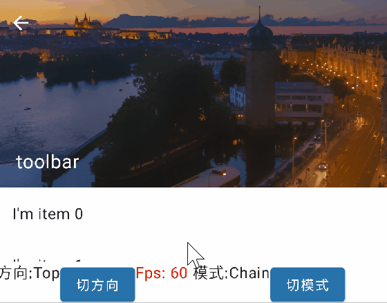
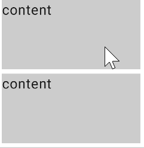

# ChainScrollableComponent

## Preview





## Usage

```kotlin
/**
 * Chain scrollable component 
 * @param minScrollPosition Minimum scroll position
 * @param maxScrollPosition Maximum scroll position
 * @param chainContent Content of chain
 * @param modifier
 * @param onScrollStop Callback of scroll stop event
 * @param composePosition Set the position of the top bar layout
 * @param chainMode Chain mode
 * @param content Content of compose
 */
@Composable
fun ChainScrollableComponent()

/**
 * Scalable top navigation bar
 * @param title Title of top bar
 * @param background Background of top bar
 * @param modifier
 * @param onScrollStop Callback of scroll stop event
 * @param minScrollPosition Minimum scroll position
 * @param maxScrollPosition Maximum scroll position
 * @param navigationIcon Icon of top bar
 * @param composePosition Set the position of the top bar layout
 * @param chainMode Chain mode
 * @param content Content of compose
 */
@Composable
fun ScrollableAppBar()

/**
 * Swipe to delete controls
 * @param minScrollPosition Minimum scroll position
 * @param maxScrollPosition Maximum scroll position
 * @param backgroundContent Content of background
 * @param modifier
 * @param contentIsMove Does content follow
 * @param content Content of compose
 */
@Composable
fun SwipeToDismiss()
```