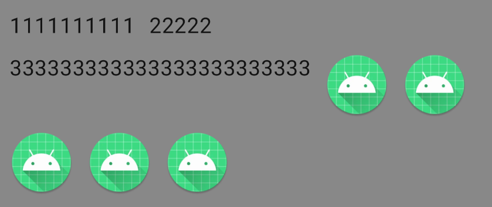

# FlowLayout

## Preview



## Usage

```kotlin
/**
 * Linear layout with word wrapping
 * @param modifier
 * @param orientation Direction of arrangement
 * @param horizontalAlignment Alignment of horizontal
 * @param verticalAlignment Alignment of vertical
 * @param horizontalMargin Margin of horizontal
 * @param verticalMargin Margin of vertical
 * @param maxLines How many lines can be placed
 * @param content Content of compose
 */
@Composable
fun FlowLayout()

/**
 * [FlowLayout] that can automatically determine the selected state
 */
@Composable
fun LabelsFlowLayout()
```