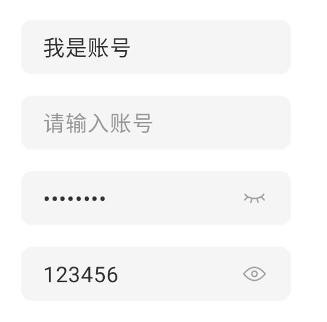

# GoodTextField and PasswordTextField

## Preview

<div align=center></div>

## Usage

```kotlin
/**
 * More convenient and easy to use the [TextField]
 * @param value Text of the [TextField]
 * @param onValueChange Text change of the [TextField]
 * @param modifier
 * @param hint Content of the [TextField] with if value is Empty
 * @param maxLines How many lines of text can be displayed
 * @param fontSize Font size of text and hint
 * @param fontColor Color of text
 * @param maxLength How many texts can be displayed at most
 * @param contentAlignment Text and hint to the way
 * @param leading Components displayed on the start
 * @param trailing Components displayed on the end
 * @param background The background
 * @param horizontalPadding Horizontal inner spacing
 * @param enabled Is it possible to enter
 * @param readOnly Read-only
 * @param textStyle The [TextStyle]
 * @param keyboardOptions Reference the [BasicTextField]
 * @param keyboardActions Reference the [BasicTextField]
 * @param visualTransformation Reference the [BasicTextField]
 * @param onTextLayout Reference the [BasicTextField]
 * @param interactionSource Reference the [BasicTextField]
 * @param cursorBrush Reference the [BasicTextField]
 */
@Composable
fun GoodTextField()

/**
 * More convenient and easy to use the [TextField], for entering passwords
 * Api is almost the same as the [GoodTextField]
 */
@Composable
fun PasswordTextField()
```