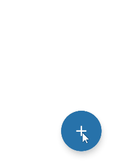

# MenuFloatingActionButton

## Preview



## Usage

```kotlin
/**
 * Floating action button
 * @param icon Menu icon
 * @param label Menu text
 * @param srcIconColor Icon color
 * @param labelTextColor Label text color
 * @param labelBackgroundColor Background color of label text
 * @param fabBackgroundColor Background color of floating action button
 */
@Composable
fun MenuFloatingActionButton()
```