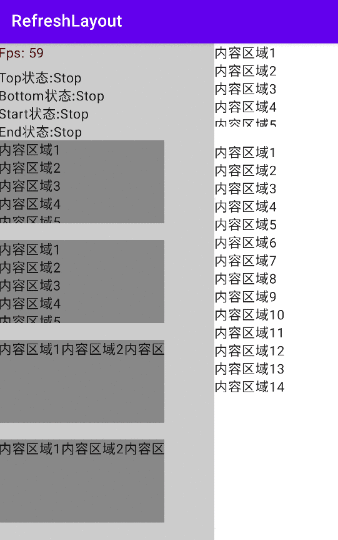

# RefreshLayout

## Preview



## Usage

### RefreshLayout

```kotlin
/**
 * The refreshed container can be dragged in any direction
 * @param refreshContent Refreshed content area
 * @param refreshLayoutState State of the [RefreshLayout]
 * @param modifier
 * @param refreshContentThreshold Refresh threshold for layout dragging
 * @param composePosition Set where the refreshed layout is located
 * @param contentIsMove Whether the content component moves with it on refresh
 * @param dragEfficiency The 'efficiency' of dragging
 * @param isSupportCanNotScrollCompose Whether to support non-scrollable components
 * @param userEnable Whether the user can drag
 * @param content Content of compose
 */
@Composable
fun RefreshLayout()
```

### PullToRefresh

```kotlin
/**
 * Pull down to refresh
 * @param refreshLayoutState State of the [RefreshLayout]
 * @param modifier
 * @param refreshContent Refreshed content area
 * @param content Content of compose
 */
@Composable
fun PullToRefresh()
```

### VerticalRefreshableLayout

```kotlin
/**
 * Pull down and up refresh components
 * @param topRefreshLayoutState State of the top of the [RefreshLayout]
 * @param bottomRefreshLayoutState State of the bottom of the [RefreshLayout]
 * @param modifier
 * @param topRefreshContent Refreshed content area of top
 * @param bottomIsLoadFinish Bottom is it loaded
 * @param bottomRefreshContent Refreshed content area of bottom
 * @param content Content of compose
 */
@Composable
fun VerticalRefreshableLayout()
```