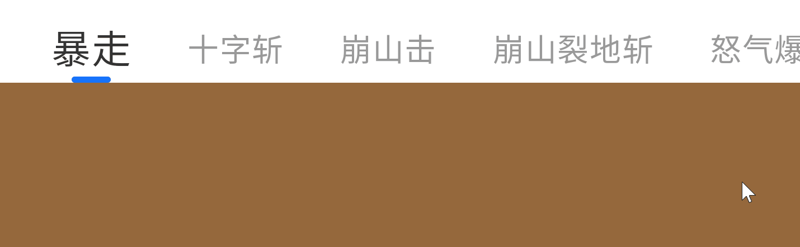

# PagerIndicator

## Preview

<div align=center></div>

<div align=center></div>

## Usage

```kotlin
/**
 * Indicator for pager
 * @param size Number of indicator
 * @param offsetPercentWithSelect The offset percentage of the selected indicator
 * @param selectIndex The index of selected indicator
 * @param indicatorItem The indicator
 * @param selectIndicatorItem The selected indicator
 * @param modifier
 * @param margin Spacing between indicators
 * @param orientation Orientation of indicators
 * @param userCanScroll Whether the user can scroll
 */
@Composable
fun PagerIndicator()

/**
 * Text indicator for pager
 * @param texts The text list
 * @param offsetPercentWithSelect The offset percentage of the selected indicator
 * @param selectIndex The index of selected indicator
 * @param fontSize Font size of the text indicator
 * @param selectFontSize Font size of the selected text indicator
 * @param textColor Font color of the text indicator
 * @param selectTextColor Font color of the selected text indicator
 * @param selectIndicatorColor Color of the indicator
 * @param onIndicatorClick Click event of the text indicator
 * @param modifier
 * @param margin Spacing between the text indicators
 * @param userCanScroll Whether the user can scroll
 */
@Composable
fun TextPagerIndicator()
```